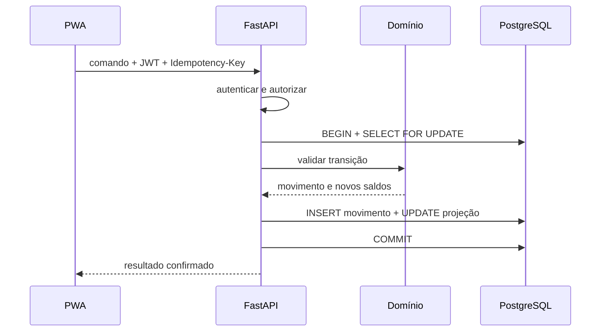

# Visão de arquitetura

## Contexto

Paper Stock Control é um produto independente. Uma integração futura com o Planix deve
usar API ou migração explícita, sem dependência de código ou banco compartilhado.

## Módulos

| Módulo | Responsabilidade |
|---|---|
| `identity` | autenticação, perfis e autorização |
| `catalog` | fornecedores, materiais e mapeamentos |
| `labels` | fotos, códigos, OCR, evidências e revisão |
| `inventory` | pallets, saldos, movimentos e rotação |
| `quality` | bloqueios, liberações e motivos |
| `locations` | posições e transferências |
| `reporting` | consultas, dashboard e exportações |
| `audit` | histórico de ações administrativas |

Os diretórios aparecem à medida que o módulo recebe comportamento. CRUD simples não é
forçado a carregar quatro camadas sem necessidade.

## Fluxo de escrita



## Invariantes iniciais

```text
available + blocked + consumed + discarded
= received + net_adjustments
```

- nenhum saldo pode ser negativo;
- movimento confirmado não é alterado ou removido;
- estorno é um novo movimento ligado ao original;
- pallet tem uma localização no MVP;
- transferência parcial exige pallet-filho e está fora do MVP.

## Contratos

Pydantic descreve request/response e o FastAPI publica OpenAPI. O cliente TypeScript é
gerado desse documento; não existem DTOs duplicados manualmente entre linguagens.

## Persistência e Supabase

- Alembic é a única origem do schema;
- Auth fornece identidade, não autorização de domínio;
- Storage é privado;
- tabelas de negócio não são atualizadas pelo navegador;
- produção deverá manter API e banco na mesma região de São Paulo.

